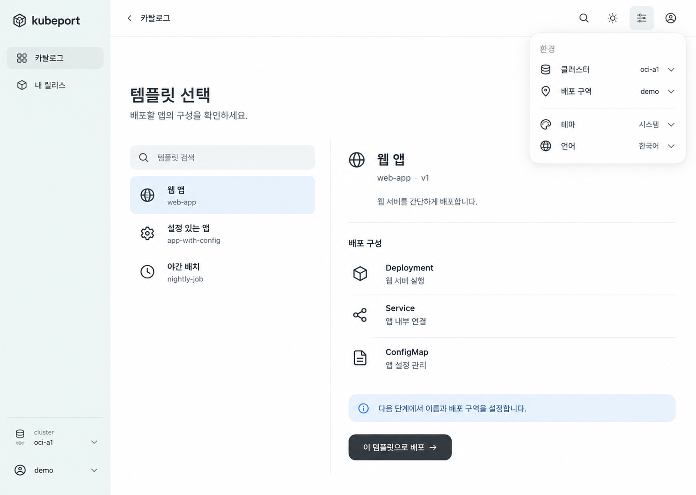
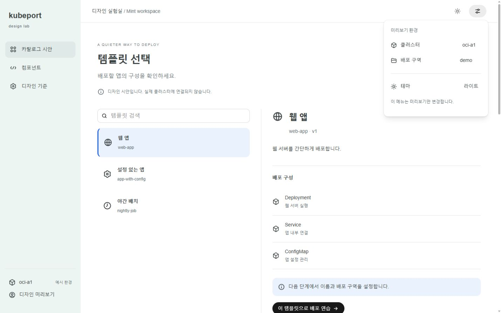

# kubeport 디자인 기준 — Mint workspace

2026-09-16 사용자와 합의한 시각적 방향. 이후 UI 작업은 이 문서를 기준으로 시작한다.

## 합의한 느낌

사용자가 제공한 Codex 데스크톱 화면의 옅은 민트 사이드바, 청회색 선택 배경, 얇고 작은 아이콘, 흰색으로 떠 있는 둥근 서브메뉴를 선호했다. 이전의 베이지·웜그레이 제안은 선호하지 않았다. 아래 이미지는 이 피드백을 반영한 마지막 시안이며, 세부 레이아웃 전체의 제품 적용까지 확정한 것은 아니다.



원본 개인 작업 화면은 저장소에 복사하지 않는다. 이미지의 문구·아이콘·비율은 콘셉트 참고이며 실제 접근성·반응형 구현의 사양을 대신하지 않는다.

## 공식 컴포넌트 우선

기본 컨트롤을 새로 복제하지 않고 **OpenAI `@openai/apps-sdk-ui` 0.2.2**를 재사용한다. 공식 [설명](https://developers.openai.com/plugins/build/chatgpt-ui#optional-openai-component-library), [소스](https://github.com/openai/apps-sdk-ui), [컴포넌트 미리보기](https://openai.github.io/apps-sdk-ui/), [MIT 라이선스](https://github.com/openai/apps-sdk-ui/blob/main/LICENSE).

이 패키지는 ChatGPT 앱용 공개 React 디자인 시스템이다. Codex 데스크톱의 내부 구현과 동일하다는 근거는 확인하지 않았다. React 18/19, Tailwind 4를 요구하며 OpenAI API 연결이나 API 키 없이 시안의 UI를 렌더링할 수 있다.

| 재사용 | kubeport에서 조합 |
| --- | --- |
| Button, Input, Badge, Checkbox, Slider, Popover, Icon | 민트 사이드바, 카탈로그 목록·상세 배치, 상태 문구, 업무 흐름 |
| 라이브러리 기본 토큰과 상호작용 | `--kp-*`로 분리한 앱 표면 색상과 간격 |

현재 제품은 shadcn/Base UI를 사용한다. 이 PR은 공개 패키지를 **개발 의존성**으로 추가하고 독립 Vite 시안에서만 사용한다. 프로덕션 전역 CSS·인증·배포 기능은 변경하지 않는다. 실제 제품 적용 시 전역 CSS 충돌, 포털 테마, 폼 어댑터, 키보드 접근성, 번들 크기를 비교한 뒤 화면 단위로 옮긴다. 두 디자인 시스템을 무작정 전역에 동시에 로드하지 않는다.

0.2.2의 Slider는 숫자 입력에만 라벨을 연결하므로 별도 손잡이에도 접근성 이름을 연결하는 작은 어댑터를 사용한다. “공식 패키지”라는 사실이 제품에 통합한 결과의 접근성 검증을 대신하지 않는다. 라이선스 고지는 패키지에 포함되어 있으며, 정적 결과를 배포할 때도 OpenAI MIT 고지를 보존한다.

## 시안 실행

저장소 루트에서:

```powershell
cd frontend
pnpm install --frozen-lockfile
pnpm design:dev
```

[로컬 시안](http://127.0.0.1:4173/)에서 카탈로그 선택, 검색과 빈 결과, 배포 연습 대화상자, 환경 팝오버, 밝기 전환, 버튼 피드백, 입력, 수량, 체크박스와 상태 배지를 확인한다. 로그인과 백엔드가 필요 없다. 실제 리소스를 생성하거나 설정을 저장하지 않는다. 새로고침하면 초기화된다. 언어는 이 합의용 시안에 한해 한국어다.

`pnpm design:build`는 `frontend/out/design-preview`에 정적 빌드한다. 개발 서버는 루프백 주소만 사용하며 서비스 자동 배포에는 포함되지 않는다. 소스 진입점은 [main.tsx](../frontend/design-preview/main.tsx), 스타일은 [style.css](../frontend/design-preview/style.css)다.



[모바일 캡처](design-assets/preview-mobile.png) · [입력 검증 캡처](design-assets/preview-user.png) · [환경 선택 확인](design-assets/preview-admin.png)

검증: 타입 검사·시안 빌드·디자인 코드 ESLint 통과, 기존 프론트엔드 137개 파일/1,624개 테스트 통과. 브라우저에서 검색·빈 결과·템플릿 선택·잘못된 이름 차단·정상 연습 완료·환경 선택·키보드 슬라이더/체크박스·Escape 복귀를 확인했다. 1440×900 및 390×844에서 라이트/다크와 열린 메뉴를 확인했고 페이지 가로 넘침은 관찰되지 않았다. 실제 프로덕션 생성·게시 검증은 포함하지 않는다.

## 앱 표면 토큰

| 역할 | 라이트 |
| --- | --- |
| 본문 표면 | `#FFFFFF` |
| 사이드바 | `#EDF5F3` |
| 내비게이션 선택 | `#DFEAE8` |
| 콘텐츠 선택 | `#EAF3FD` |
| 기본 텍스트 | `#373E40` |
| 보조 텍스트 | `#626E72` |
| 포커스·링크 | `#2563EB` |

큰 그림자와 보라색 강조를 반복하지 않는다. 공간·정렬·글자 크기로 먼저 구분하고, 구분선은 보조로 사용한다. 아이콘은 공식 Icon 패키지에서 가져온다. 메뉴와 대화상자에만 높이감을 준다. 연한 배경은 장식이며, 선택 여부는 `aria-pressed`, 테두리 등으로도 표시한다. 다크 모드는 사용자 원본에 없는 확장 제안이다.

## 적용 전에 지킬 것

- 배포 구역·클러스터는 제출 전에 명확히 보여준다. 모든 중요 정보를 환경 메뉴 안에만 숨기지 않는다.
- 상태 색상을 줄이더라도 정상·준비·실패·미확인을 문구와 아이콘으로 구분한다.
- 비전문 사용자에게 Deployment 등의 리소스 목록을 먼저 읽도록 강요하지 않는다. 실제 제품에서는 업무 설명을 먼저, 기술 상세를 보조로 검토한다.
- 제품 전체 재설계와 기존 이슈 #402–#406의 해결은 이 시안 PR과 별도 작업이다.

사용 흐름의 평가와 다음 개선 순서는 [사용 흐름 평가](user-flow-review.md)를 참고한다.
