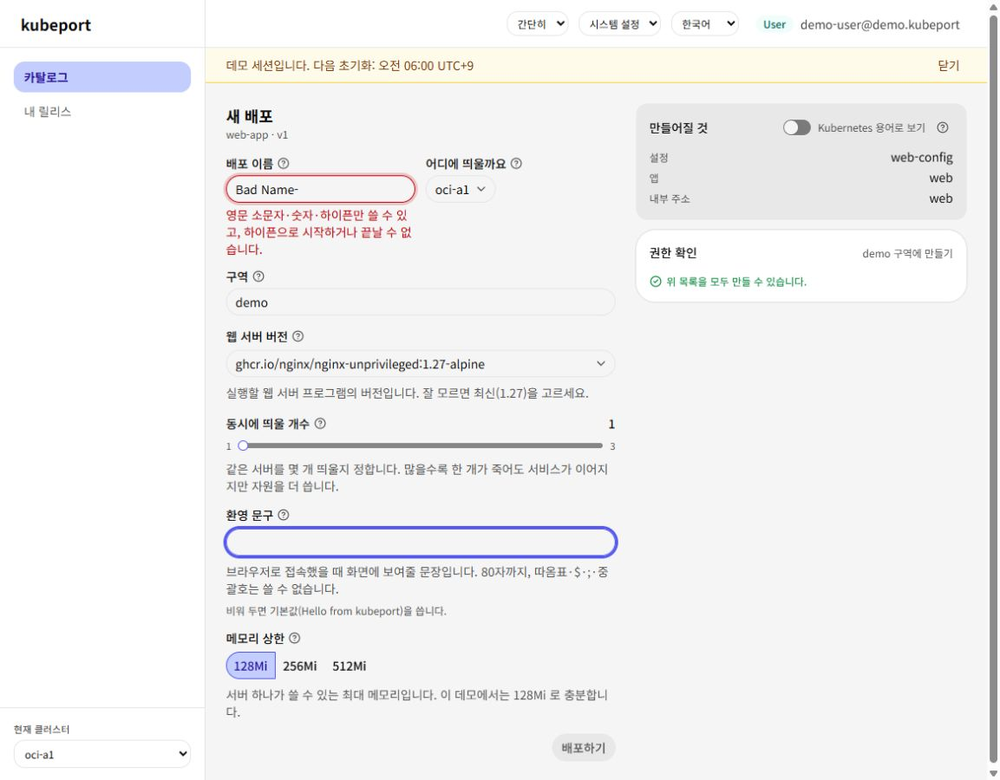
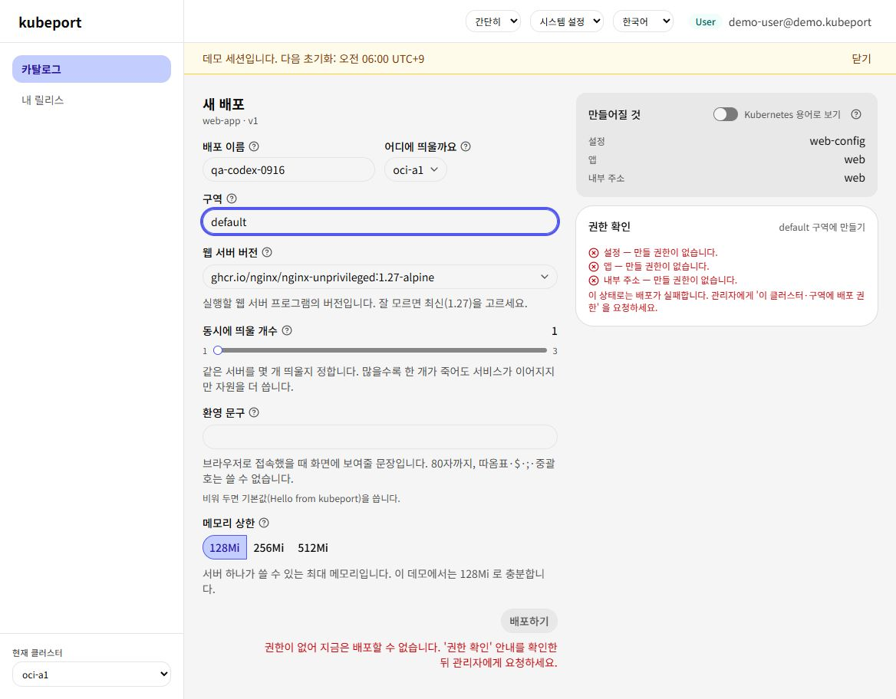
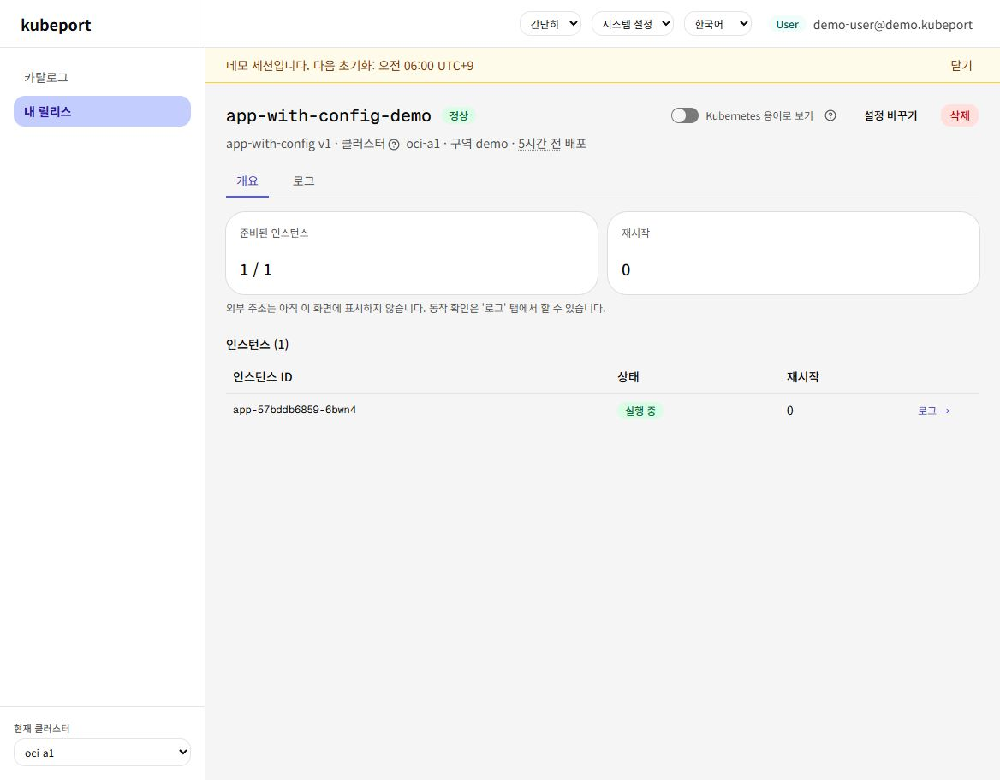
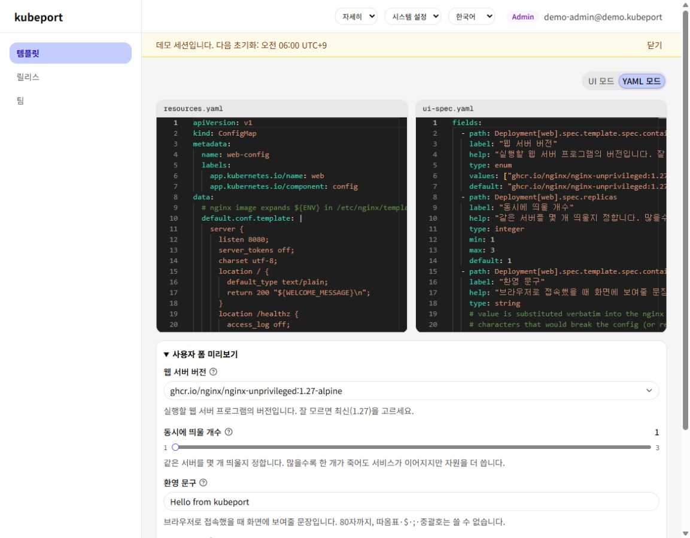
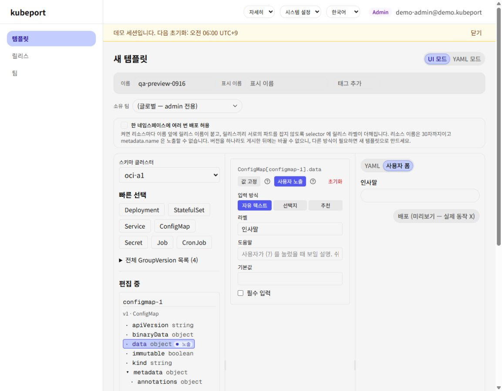

# 관리자·일반 사용자 흐름 평가

평가일: 2026-09-16. 대상: kubeport의 의도인 **관리자는 Kubernetes YAML을 재사용 가능한 템플릿으로 만들고, 비전문 사용자는 필요한 값만 입력해 배포·변경·관찰한다**.

## 결론

**플랫폼 관리자가 잘 만든 템플릿을 제공하는 사내 셀프서비스 도구로는 방향이 좋다. 다만 “설명 없이 처음 쓰는 사용자도 실패를 복구하며 운영한다”까지는 안내가 부족하다.** 관리자에게는 템플릿 제작의 일관성을, 사용자에게는 배포 이후의 판단과 복구를 강화하는 것이 색상 변경보다 우선이다.

이는 전문가 휴리스틱 평가이며 실제 고객 사용성 실험 결과나 정량 점수가 아니다. Kubernetes를 전혀 모르는 사람, 앱 개발 경험은 있지만 클러스터를 관리하지 않는 사람, 플랫폼 운영자를 구분해 검증해야 한다.

## 근거와 범위

같은 세션의 데모 점검(로컬·라이브 `5e805d8`)에서 사용자·관리자 로그인, 카탈로그, 입력 검증, 권한 거부, 정상 릴리스, 로그, 설정 변경 진입, 버전 목록, YAML·시각 편집기 미리보기, 팀 화면을 관찰했다. 아래 캡처는 당시 기록이다. 이번 문서 작성 시 라이브 상태를 다시 측정했다고 주장하지 않는다.

실제 생성→정상 준비→설정 적용→삭제의 전체 실행, 관리자 게시, 팀 권한 변경, 복수 클러스터 운영은 **미검증**이다. 앞선 점검 당시 생성 단계의 자동 승인 제한으로 제출하지 않았고, 이후 사용자가 허용했지만 작업 우선순위가 이슈·디자인 기록으로 바뀌었다. 화면의 성공과 실제 클러스터 작업 성공은 구분한다.

## 같은 날 반영된 개선 (2026-09-16)

아래 역할별 표와 캡처는 수정 전 `5e805d8`의 관찰 기록이다. 이후 main에 반영된 변경은 다음과 같으며, 해결된 항목을 미해결 결함으로 다시 등록하지 않는다.

| 반영 | 변경과 남은 범위 |
| --- | --- |
| #408 → #406 | YAML 편집기에 템플릿 이름·버전·상태 표시 |
| #409 → #403 | 검색·슬라이더 손잡이·로그 선택기의 접근성 이름 연결 |
| #410 → #402·#404·#405 | 모바일 헤더 줄바꿈, 실패 데모 5분 주기와 실행·이력 제한, 데모 권한 거부 시 허용 구역 안내. 기존 시드는 리셋 후 반영 |
| #411 | Pretendard·선택 메뉴·글자 크기·편집기 패널과 저장 바 개선. 외부 주소 없는 릴리스에 다음 행동과 로그 링크, 새 템플릿의 데모 제한 사전 안내, 데모 팀 생성 비활성화 |
| #413 | 랜딩에 공통 비밀번호와 역할별 계정 카드를 배치해 체험 진입 개선. Dex 로그인 화면에서는 계정 정보를 입력해야 함 |

당시 검증 기록상 #411·#413은 CI/E2E·이미지 빌드·OCI 배포 확인을 마쳤다. 운영에서 사용자 폼·선택 메뉴·릴리스의 로그 링크, 관리자 제한 안내·팀 생성 비활성화·1440px 3열/1280px 탭을 확인했다. 이 확인은 리소스 변경 없이 수행했으므로 위의 전체 수동 흐름 미검증 범위는 유지한다. 객체형 필드를 문자열로 노출하는 후속은 [#412](https://github.com/shyuni4u/kubeport/issues/412), 전체 수동 점검은 [QA 체크리스트](qa-checklist.md)를 따른다. 이번 문서 갱신에서 운영 상태를 재측정하지는 않았다.

## 일반 사용자

| 단계 | 현재 도움이 되는 점 | 남는 부담과 개선 방향 |
| --- | --- | --- |
| 진입·로그인 | 사용자/관리자 체험 경로와 계정을 제공 | 체험 버튼이 첫 화면 아래에 있었고 Dex 이메일을 다시 입력해야 했다. 시작 행동과 복사할 자격정보를 가까이 배치 |
| 템플릿 고르기 | 이름·설명·태그로 선택 가능 | 템플릿 이름만으로 배포 결과를 예상하기 어렵다. 무엇을 얻고 어떤 값을 준비하는지 설명 |
| 값 입력 | YAML 대신 폼, 기본값, 유효성 검사 제공 | 클러스터·배포 구역·권한을 이해해야 한다. 허용 구역 추천과 제출 전 요약 제공 |
| 권한 거부 | 생성 권한이 없을 때 제출을 차단 | “관리자에게 문의” 이후 무엇을 할지 불명확. 데모에서는 허용 구역으로 복구 (#405) |
| 준비 상태 확인 | 정상 1/1, 재시작, 인스턴스와 로그 제공 | “알 수 없음 0/0”은 대기인지 장애인지 판단하기 어렵다. 예약 대기/실패/정보 부족을 구분 (#404와 연관) |
| 앱 사용 | 외부 주소가 없다는 사실을 안내 | 사용자가 기대한 “내 앱 열기”까지 이어지지 않을 수 있다. 템플릿의 접속 방식과 노출 범위를 배포 전에 명시 |
| 변경·장애 대응 | 기존 값·Secret 유지 안내, 로그 접근 | 로그만으로 문제를 해결하기 어렵다. 원인 요약→가능한 조치→기술 상세 순서 필요 |

**사용자에게 이상적인 흐름:** 목적에 맞는 앱 선택 → 필요한 값과 허용 구역만 설정 → 생성될 앱·접속 방식 확인 → 준비 상태 안내 → 앱 열기 또는 실행 결과 확인 → 필요할 때 변경/복구. 기술 용어는 업무 설명을 대체하는 기본 언어가 아니라, 상세 설명으로 제공하는 편이 목적에 맞다.

## 관리자

| 단계 | 현재 도움이 되는 점 | 남는 부담과 개선 방향 |
| --- | --- | --- |
| 리소스 정의 | pure YAML과 UI 오버레이를 분리해 기존 Kubernetes 지식 활용 | 관리자는 YAML, 스키마, RBAC를 이해해야 한다. 이것은 대상 사용자의 전제이며 “누구나 만드는 노코드 도구”로 소개하면 기대가 어긋남 |
| 폼 노출 | 필드를 고르고 라벨을 바꾸며 미리보기 확인 | 어떤 기본값·제약·도움말이 사용자에게 안전한지 설계 책임이 크다. 업무 목적에 맞는 샘플 템플릿과 작성 체크리스트 필요 |
| 편집 | 구조/속성/미리보기와 YAML 모드를 모두 제공 | YAML 편집 중 대상 템플릿·버전 헤더가 부족 (#406). 항상 편집 대상과 초안 상태 표시 |
| 게시 | 게시본과 초안을 구분하는 버전 모델 | 게시 직전 실제 사용자 역할에서 입력·권한·렌더 결과를 확인하는 작업 흐름을 더 명시. 이번 점검에서는 게시 미실행 |
| 운영·권한 | Kubernetes RBAC를 존중하고 팀 화면 제공 | UI상 팀 소속과 실제 클러스터 권한의 관계를 오해하지 않도록 안내. 팀 변경·복수 클러스터 검증 필요 |
| 버전 유지 | 릴리스가 템플릿 버전에 고정되는 예측 가능한 구조 | 새 버전 게시와 기존 릴리스 업그레이드가 같은 행동이 아님을 명확히 설명 |

**관리자에게 이상적인 흐름:** 표준 리소스 가져오기 → 사용자에게 필요한 값만 노출 → 이름/기본값/검증/도움말 정의 → 사용자 역할의 미리보기 및 권한 확인 → 초안 테스트 → 게시 → 기존 사용 버전과 영향 범위 관찰.

## 개선 순서

1. **수정 후 회귀 확인:** #402–#406의 수정은 #408–#410에 반영됐다. [QA 체크리스트](qa-checklist.md)로 재발 여부와 실패 데모의 시드 반영을 확인하고, 객체형 필드 노출 후속 #412를 추적한다.
2. **사용자 성공 기준:** 템플릿마다 결과·필요한 입력·접속 방식·예상 대기를 설명하고, 배포 후 “이제 할 일”을 안내한다. 접속 주소가 없는 배치 작업은 완료/로그 확인으로 분기한다.
3. **관리자 품질 기준:** 게시 전에 기본값·검증·도움말·Secret 처리·허용 역할·렌더 결과를 확인하는 짧은 체크리스트를 도입한다.
4. **시각 시스템 이행:** 합의한 디자인을 작은 화면부터 적용하되 업무 정보가 숨지 않는지 사용자 테스트한다. 디자인 실험실은 검토 수단이며 제품 개선 완료가 아니다.

2–3번은 관찰에서 도출한 제품 제안이며, 기존 버그와 섞어 “현재 기능이 고장났다”고 해석하지 않는다.

## 다음 사용성 검증

플랫폼 관리자 3명과 클러스터를 직접 관리하지 않는 앱 사용자 5명으로 소규모 정성 실험을 제안한다. 이는 통계적 대표성을 주장하는 표본이 아니다.

- 사용자: 웹 앱 배포, 잘못된 구역에서 복구, 준비 여부 판단, 설정 변경, 실패 원인 찾기, 삭제. 첫 성공까지 시간·도움 요청 횟수·잘못 이해한 용어를 기록한다.
- 관리자: 기존 YAML로 템플릿 작성, 3개 입력 노출, 제약 설정, 사용자 미리보기, 초안 테스트와 게시. 문서 밖의 지식이 필요했던 지점을 기록한다.
- 완료 기준: 테스트 리소스 정리까지 확인하고, 화면을 찾은 것과 실제 작업 성공을 별도로 집계한다. 모바일·키보드·한국어/영어도 나눠 확인한다.
